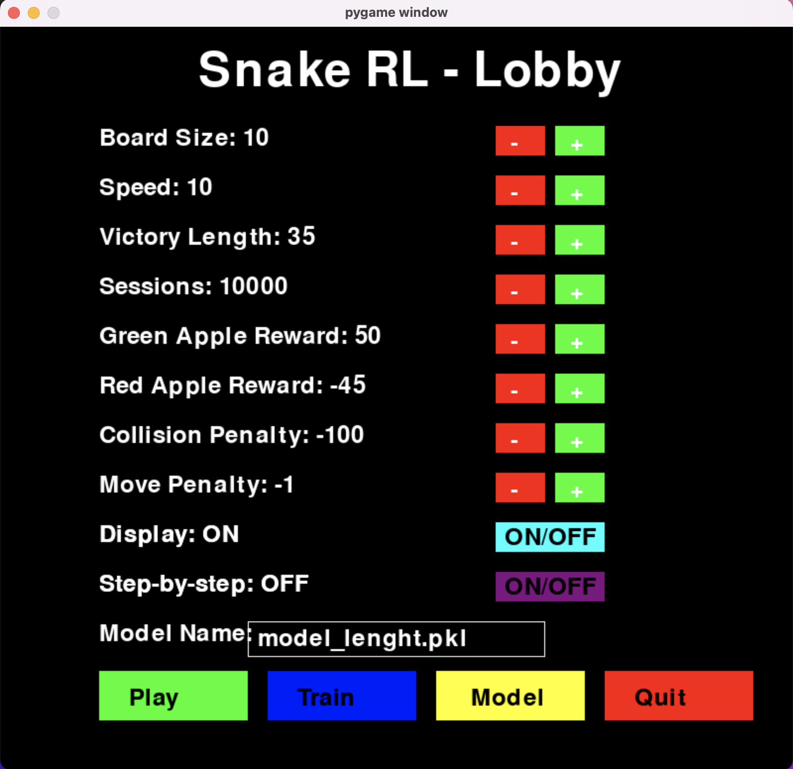
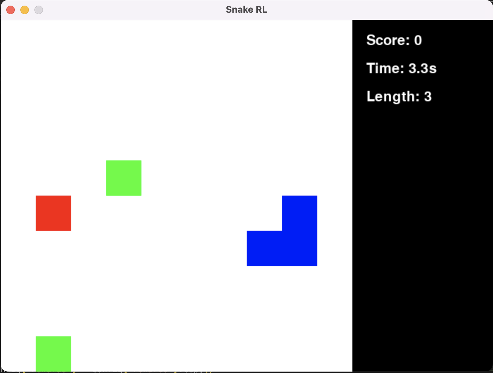
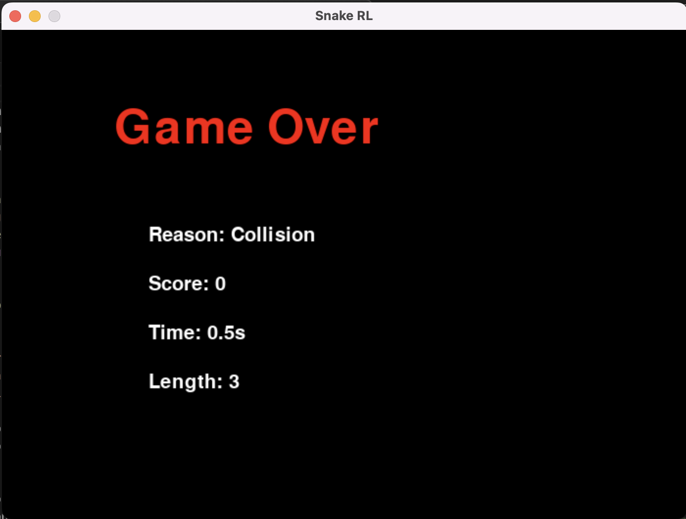
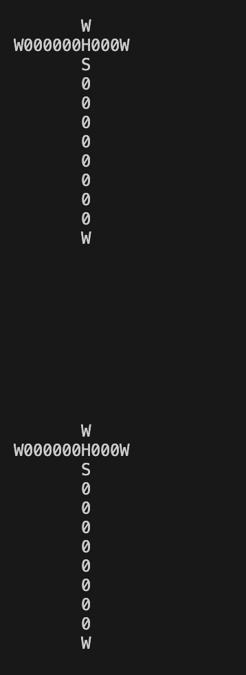

# Learn2Slither – Snake AI with Reinforcement Learning

> A Reinforcement Learning project where an agent learns to play Snake by trial and error.

---

## Project Overview

**Learn2Slither** is a Snake game controlled by a Reinforcement Learning agent using the Q-learning algorithm. The snake learns to survive and grow by collecting green apples, avoiding red apples, and steering clear of collisions.

The AI improves over thousands of sessions by receiving feedback (rewards/penalties) and updating its strategy accordingly. So it learns by making mistakes

---

## Features

- 100% Python, no external RL libraries
- Custom Q-learning logic
- Limited vision (4 directions)
- Model save/load system
- Training & test modes
- Real-time GUI with score/time/length
- Fully customizable parameters from the lobby

## Screenshots

### Main Menu – Interactive Configuration


### Game Running – With live stats


### Game Over Screen


### Agent's Vision Printed in Console


---

## How to Run

> Requirements: Python 3.10+ with [Poetry](https://python-poetry.org/)

### 🔧 Installation

```bash
poetry install
```

## Launch

```bash
poetry run python3 main.py  
```

 ### An interactive menu will open with configurable options:

- Board size
- Speed
- Number of training sessions
- Victory length
- Rewards and penalties
- Display on/off
- Step-by-step mode
- Model filename

### You can then choose:

- Play a session
- Train the agent
- Load a model
- Quit

## Agent Behavior

**Vision**: The snake sees in 4 directions only from its head (UP, LEFT, DOWN, RIGHT)
**Actions**: The agent chooses one of the 4 directions based on what it sees
**Learning**: Q-learning updates a Q-table associating states to actions
**Rewards**:
    +50 for a green apple
    -45 for a red apple 
    -100 for a collision
    -1 per move to encourage efficiency

## Tech Stack

- Python 3.11
- **Poetry** – for dependency & project management
- **NumPy** – fast numerical operations (Q-table, vector logic)
- **Pandas** – optional data handling and analysis
- **Pygame** – real-time graphical interface
- **PyYAML** – configuration file parsing (e.g., model or reward settings)

## Possible Enhancements

 - Visual Q-table heatmap
 - Performance chart over time
 - Custom board size from CLI
 - Export results to CSV

 ## Author
  - Np93